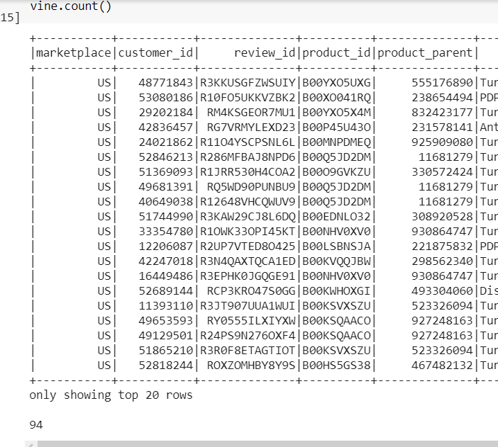
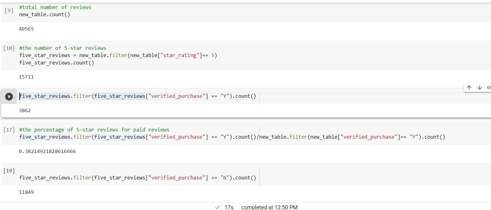

# Big Data

## Overview of the analysis

- The purpose of this project is to use PySpark to perform the ETL process to extract the dataset, transform the data, connect to an AWS RDS instance, and load the transformed data into pgAdmin. The product category I picked was Video Games. Next, PySpark was used to determine if there is any bias toward favorable reviews from Vine members in your dataset.

## Results

- How many Vine reviews and non-Vine reviews were there?
  - There were 94 vine reviews and 40471 non-vine reviews.

- How many Vine reviews were 5 stars? How many non-Vine reviews were 5 stars?
  - 3862 Vine reviews were 5 stars and 11849 non-Vine reviews were 5 stars.
  
- What percentage of Vine reviews were 5 stars? What percentage of non-Vine reviews were 5 stars?
  - Around 38.2% of the Vine reviews were 5 stars and around 38.9% of the non-Vine reviews were 5 stars.

 
## Summary

- According to the data, there is no positivity bias for reviews in the Vine program. The percentages were very similar. In fact, the percentage of Vine reveiws that were 5 starts were smaller than that of the non-Vine reviews.
- Another analysis that could be done to further prove that the paid programme does not lead to positivity biases is to look at how many helpful reviews did the Vine reviews get versus the non-Vine reviews. If a big percentage of the helpful reviews were written by Vine users, that means they actually tried the product and did not just get paid to write positive reviews.
